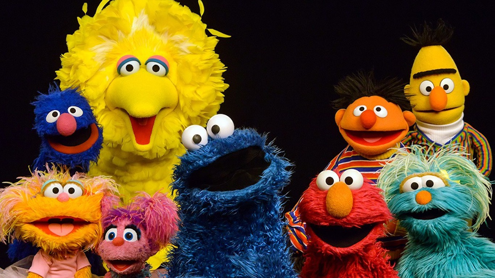

# sesamestreet

Collection of character level language models implemented from scratch

1. cookiemonster - bigrams language model with typical Bigram statistics and neural network approach
2. elmo -  multilayer perceptron for character level language model (training custom embeddings)
3. ernie -  multilayer perceptron for character level language model (with implemented custom backpropagation)
4. grover - convolutional neural network architecture similar to the WaveNet (2016) from DeepMind
